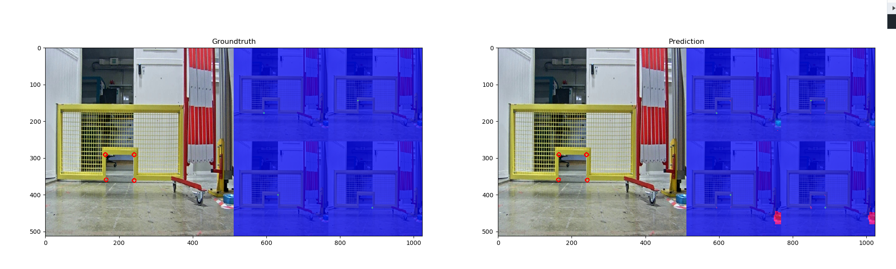

# PyTorch-Pose

PyTorch-Pose is a PyTorch implementation of the general pipeline for 2D single human pose estimation. The aim is to provide the interface of the training/inference/evaluation, and the dataloader with various data augmentation options for the most popular human pose databases (e.g., [the MPII human pose](http://human-pose.mpi-inf.mpg.de), [LSP](http://www.comp.leeds.ac.uk/mat4saj/lsp.html) and [FLIC](http://bensapp.github.io/flic-dataset.html)).

Some codes for data preparation and augmentation are brought from the [Stacked hourglass network](https://github.com/anewell/pose-hg-train). Thanks to the original author.

This code has been adapted to do door detection in the Super Proton Synchrotron accelerator. The main interest there is to have a very lightweight network (3.56M parameter) as the robot ressources are very scarced.


.. figure:: docs/example1.png

.. figure:: docs/example2.png

.. figure:: docs/example3.png


## Features
- Multi-thread data loading
- Multi-GPU training
- Logger
- Training/testing results visualization

## Installation
1. PyTorch (>= 0.2.0): Please follow the [installation instruction of PyTorch](http://pytorch.org/). Note that the code is developed with Python2 and has not been tested with Python3 yet.

2. Clone the repository with submodule
   ```
   git clone --recursive https://github.com/Vidra98/DoorDetection
   ```

4. Modify your `.bashrc` file:
   ```
   export PYTHONPATH=".:$PYTHONPATH"
   ```

## Usage

In our case, we want to identify the doors keypoints to do pose estimation later on 

### Dataset 
To be able to train the model, the first step is to annotate the dataset. This is done using CVAT and custom video of the gate in the mockup and later on in the tunnel.

The point are always annotated in the order : bottom left -> top left -> top right -> bottom right

### Folder architecture

```
├── acces_token.txt
├── checkpoint
│   └── spsdoor
│       ├── hourglass_1
│       │   ├── 16_feats
│       │   │   ├── i256_o512_inplane_32
│       │   │   │   ├── checkpoint.pth.tar
│       │   │   │   ├── log.eps
│       │   │   │   ├── log.txt
│       │   │   │   ├── model_best.pth.tar
│       │   │   │   ├── model_dict.ckpt
│       │   │   │   ├── preds_best.mat
│       │   │   │   └── preds.mat
│       │   │   └── i256_o512_inplane_32_aug
│       │   ├── 32_feats
│       │   └── info
│       ├── hourglass_2
│       └── hourglass_3
├── command.txt
├── cpp_reader
│   ├── build
│   ├── CMakeLists.txt
│   └── main.cpp
├── data
│   └── spsDoor
│       ├── distorted_dataset.tar.xz
│       ├── mean.pth.tar
│       ├── test
│       │   ├── annotations
│       │   │   └── instances_default.json
│       │   └── images
│       │       ├── door_0.jpg
│       │       ...
│       │       └── door_46.jpg
│       ├── train
│       │   ├── annotations
│       │   │   └── instances_default.json
│       │   └── images
│       │       ├── door_0.jpg
│       │       ...
│       │       └── door_262.jpg
│       ├── train2
│       │   ├── annotations
│       │   │   └── instances_default.json
│       │   └── images
│       │       ├── door_0.jpg
│       │       ...
│       │       └── door_222.jpg
│       ├── undistorted_dataset.tar.xz
│       └── val
│           ├── annotations
│           │   └── instances_default.json
│           └── images
│               ├── door_0.jpg
│               │    ...
│               └── door_56.jpg
├── example
│   ├── bidon.py
│   ├── huh.py
│   ├── lsp.py
│   ├── read_curves.py
│   ├── spsDoor2.py
│   └── spsDoor.py
├── LICENSE
├── modif.txt
├── README.md
├── script
│   ├── hourglass_1
│   ├── hourglass_3
│   └── training_512
└── torchscript
    └── export.py
```

### Training
Run the following command in terminal to train an 1-stack of hourglass network on the door dataset.

```
python3 ./example/spsDoor.py --checkpoint PATH_TO_CHECKPOINT_FOLDER --resume PATH_TO_CHECKPOINT_FOLDER/model_best.pth.tar -a
```
example :
```
python3 ./example/spsDoor.py --checkpoint checkpoint/spsdoor/hourglass_1/conv1_stride1/hg1b1_aug_data2/ --resume checkpoint/spsdoor/hourglass_1/conv1_stride1/hg1b1_aug_data2/model_best.pth.tar -a
```

Please refer to the --help argument for a list of the supported options/arguments.

### Testing

To test the network you can run the same command as training but adding the argument:

For a quick start, you can retrain the network using the command 

```
python3 ./example/spsDoor.py --checkpoint checkpoint/spsdoor/hourglass_1/conv1_stride1/hg1b1_aug_data2/ --resume checkpoint/spsdoor/hourglass_1/conv1_stride1/hg1b1_aug_data2/model_best.pth.tar -e -d
```

### Important argument

* `-aug` augment the data
* `--resume` will load the weight from a specific model
* `-e` stands for evaluation only
* `-d` will visualize the network output. It can be also used during training
* EXPLAIN OTHER HYPER PARAMETER

The result will be saved as a `.mat` file (`preds_valid.mat`), which is a `2958x16x2` matrix, in the folder specified by `--checkpoint`.

#### Result

## Contribute
Please create a pull request if you want to contribute.
